# Self-Compaction Flowchart

Decision logic for self-compaction. Companion to README.md's prose protocol —
same species as `SKILL-OF/claude-code-account-login`'s FLOWCHART.md/README.md
split (login-dance and self-compaction are both "get a 2D/0QQ agent through
a 1D-blocked, interactive, TUI-locking action via a guardian in a separate
pane" — the login dance locks on OAuth callback, self-compaction locks on
the compactor). They should stay cross-linked, not just parallel.

**Corrects an error Meridian (w14-1) made live, 2026-09-23**: the unsubmitted
hold state is NOT a mistake to avoid — it's the point. The actual error was
notifying the guardian with a plain (unpinned) channel post instead of a
pane-pinned @mention or direct a2a send, which left the guardian idle and
unaware while the dancer sat correctly holding state.

```mermaid
flowchart TD
    Start([Compaction needed:\ncontext ceiling approaching,\nor voluntary custom-guided compact]) --> GuardianCheck{Guardian agent\navailable and\nreachable?}

    GuardianCheck -- No --> NoGuardianPath[Submit /compact directly.\nNo pre-verify, no continuance\nkick-start on wake. Accept the\nunmoved-orphan risk.]

    GuardianCheck -- Yes --> Build[Build /compact command via\n4+ small terminal_send calls,\nALL submit:false until decided]

    Build --> WantVerify{Want guardian\nverification before\nfiring?}

    WantVerify -- No --> DirectSubmit[Final terminal_send\nsubmit:true, OR\nself terminal_send_key enter]
    DirectSubmit --> Deaf1

    WantVerify -- Yes --> HoldState[HOLD: command sits unsubmitted\nin your own input box.\nThis is a VALID, SAFE state —\nyou are NOT deaf yet.]

    HoldState --> Notify{How do you\nnotify the guardian?}

    Notify -- Plain channel_post,\nno pane pin --> BadNotify[⛔ BADGE-ONLY.\nGuardian stays idle.\nHold state persists indefinitely,\nnobody comes.\nCONFIRMED FAILURE MODE 2026-09-23]

    Notify -- Pane-pinned @mention\nOR direct a2a_task_send --> GoodNotify[✅ Guardian's turn is triggered.\nThey will actually read your pane.]

    BadNotify -.human must relay.-> GoodNotify

    GoodNotify --> GuardianReads[Guardian: terminal_read your ptyId,\nconfirms command text visible\nand correct]

    GuardianReads --> GuardianDecision{Guardian's call:\napprove or reject?}

    GuardianDecision -- Approve --> SendEnter[Guardian: terminal_send_key\nptyId, key: enter]
    SendEnter --> Deaf1

    GuardianDecision -- Reject --> SendEscape[Guardian: terminal_send_key\nptyId, key: escape\nClears input box]
    SendEscape --> Retry[Guardian notifies dancer:\nrevise and rebuild.\nDancer's session unaffected —\nloop back to Build]
    Retry --> Build

    Deaf1[DEAF WINDOW starts NOW —\nat submit, not at hold] --> WaitFor{What ends deafness?}

    WaitFor -- Compaction completes --> NewInstance[New instance wakes\nwith compacted summary.\nUNMOVED state — no automatic\ncontinuation prompt fires.]
    WaitFor -- Command gets cleared\nbefore firing e.g. stray escape --> Cleared[Back to normal turn,\nnothing compacted]

    NewInstance --> GuardianKickstart{Guardian watching\nfor completion?}
    GuardianKickstart -- Yes --> Kickstart[Guardian polls terminal_read,\nsees compaction finish,\nsends orientation message —\nchannel context, what just\nhappened, what to do next]
    GuardianKickstart -- No --> Orphan[New instance sits idle,\nhas context, no instruction.\nMust self-orient from\nchannel unreads + memory.]

    Kickstart --> Done([New instance oriented,\nresumes real work])
    Orphan --> SelfOrient[New instance: read channel\nunreads, SessionStart:compact\nbanner for instance number,\nMEMORY.md, resume]
    SelfOrient --> Done
```

## Key corrections vs. the first live run (2026-09-23)

1. **Hold-and-verify is valid, not a mistake.** Victor, direct: *"There IS
   a way to hold the state and wait, but the ONLY thing you can wait for
   is the compaction. Once you start a self compaction, your ears are
   filled with wax."* The hold state (command built, unsubmitted) is
   pre-deaf. You can wait there indefinitely. Deafness starts at submit.

2. **The single real failure was notification transport, not the protocol
   step.** Plain `channel_post` without a pane-pinned mention is
   badge-only — see `AGENTS.md`'s delivery hierarchy. It does not wake an
   idle guardian. A dancer who asks for verification via an unpinned post
   and then holds state has created a silent deadlock: correct process,
   wrong envelope.

3. **Escape genuinely aborts and clears** — this gives the guardian real
   veto power, not just advisory comment. Approve = Enter. Reject = Escape
   + ask for a revision. Both are first-class guardian actions.

4. **The continuance gap is real and separate from the hold/verify
   question.** Whether or not a guardian verified before submit, a
   manually-compacted new instance wakes unmoved unless a guardian is
   *also* watching for completion and sends an orientation message. These
   are two different guardian duties (pre-submit verify, post-compact
   kick-start) that can be done by the same guardian in sequence, but
   don't conflate them — a guardian who only does one has half the job.

## Cross-reference to login-dance

Both skills share the same underlying shape: a 2D/0QQ agent needs a
guardian in a separate pane because the action itself (OAuth callback wait;
compaction) locks or deafens the actor's own turn loop. Both require
pane-pinned notification (not plain channel posts) to actually reach an
idle guardian. Both have a "the actor cannot verify their own outcome —
only an outside read is reliable" step (browser/URL state for login-dance;
terminal_read of the actor's own pane for self-compaction). If either
skill's guardian-notification doctrine changes, check the other for the
same fix.
